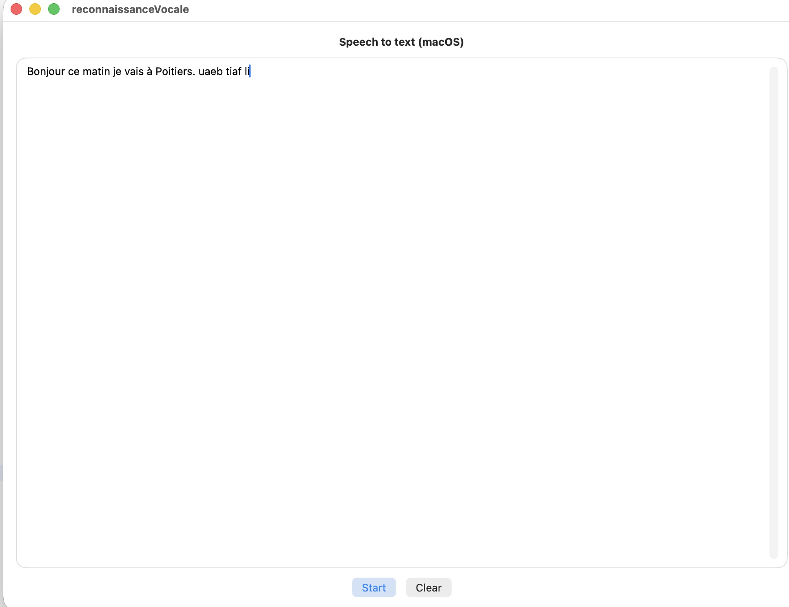

# Reconnaissance-Vocale

Application macOS de reconnaissance vocale écrite en SwiftUI, permettant de dicter du texte et de l’insérer précisément au curseur ou à la sélection dans un éditeur multilignes natif.

Ce projet propose une base propre pour :
- la reconnaissance vocale en français (`fr-FR`),
- l’intégration SwiftUI / AppKit (`NSTextView`),
- la gestion fiable du curseur et de la sélection,
- une prévisualisation en direct de la dictée,
- l’insertion ou le remplacement du texte uniquement au moment du Stop.

---

## Fonctionnalités

- 🎙️ Reconnaissance vocale en français (Speech framework)
- ✍️ Éditeur multilignes natif basé sur `NSTextView`
- 👁️ Prévisualisation en direct du texte dicté
- 📍 Insertion au curseur ou remplacement de la sélection au Stop
- 🔠 Réglage dynamique de la taille de la police via un slider
- 🧠 Gestion correcte du focus, de la sélection et du caret
- ⛔ Aucune modification du texte pendant l’écoute (mode sûr)

---

## Prérequis

- macOS 13 ou supérieur recommandé  
- Xcode 15 ou supérieur  
- Swift 5.9+

---

## Configuration indispensable

### 1. Activer l’App Sandbox

Dans **Target > Signing & Capabilities** :

- Activer **App Sandbox**
- Cocher **Audio Input**

### 2. Ajouter les clés d’autorisations dans Target > Info

Ajouter les deux entrées suivantes :

| Key | Type | Valeur |
|-----|------|--------|
| Privacy - Microphone Usage Description | String | Accès au micro pour la dictée |
| Privacy - Speech Recognition Usage Description | String | Accès à la reconnaissance vocale |

Sans ces clés, l’application plantera ou refusera l’accès au micro.

---

## Utilisation

1. Placez le curseur dans l’éditeur ou sélectionnez un texte.
2. Cliquez sur **Start**.
3. Parlez : le texte apparaît en prévisualisation.
4. Déplacez librement le curseur ou modifiez la sélection pendant l’écoute.
5. Cliquez sur **Stop** :
   - le texte dicté est inséré au curseur,
   - ou remplace exactement la sélection.

Le bouton **Clear** efface le contenu de l’éditeur et les buffers internes.

Le slider permet d’ajuster dynamiquement la taille de la police dans l’éditeur.

**Le texte final peut être copier/coller.**

---

## Structure du projet

- `ContentView.swift`  
  Interface principale, gestion du flux Start / Stop, insertion du texte dicté.

- `MacTextView.swift`  
  Wrapper SwiftUI autour de `NSTextView` :
  - édition multilignes native,
  - synchronisation du texte et de la sélection,
  - contrôle de la police et du focus.

- `SpeechRecognizer.swift`  
  Encapsulation de `SFSpeechRecognizer` et `AVAudioEngine` :
  - gestion des résultats partiels et finaux,
  - démarrage / arrêt propre de la session audio.

---

## Limitations connues

- Langue fixée à `fr-FR` (modifiable dans `SpeechRecognizer`).
- Pas de sauvegarde automatique du texte.

---

## Licence

Ce projet est distribué sous licence **MIT**.  
Voir le fichier `LICENSE` pour plus de détails.

---

## Remerciements

Ce projet a été développé par **philippe86220**.

Certaines parties de l’intégration SwiftUI / AppKit (wrapper `NSTextView`, gestion de la sélection, stratégie “prévisualisation puis insertion au Stop”) ont été réalisées avec l’assistance de **ChatGPT**.

---

## Roadmap possible

- [ ] Ajout de commandes vocales (ponctuation, nouvelle ligne, etc.)
- [ ] Choix de la langue dynamiquement
- [ ] Mode “ajout automatique avec espaces intelligents”
- [ ] Sauvegarde / chargement de fichiers texte
- [ ] Préférences utilisateur (police, taille par défaut)

---

## Capture d’écran

---

